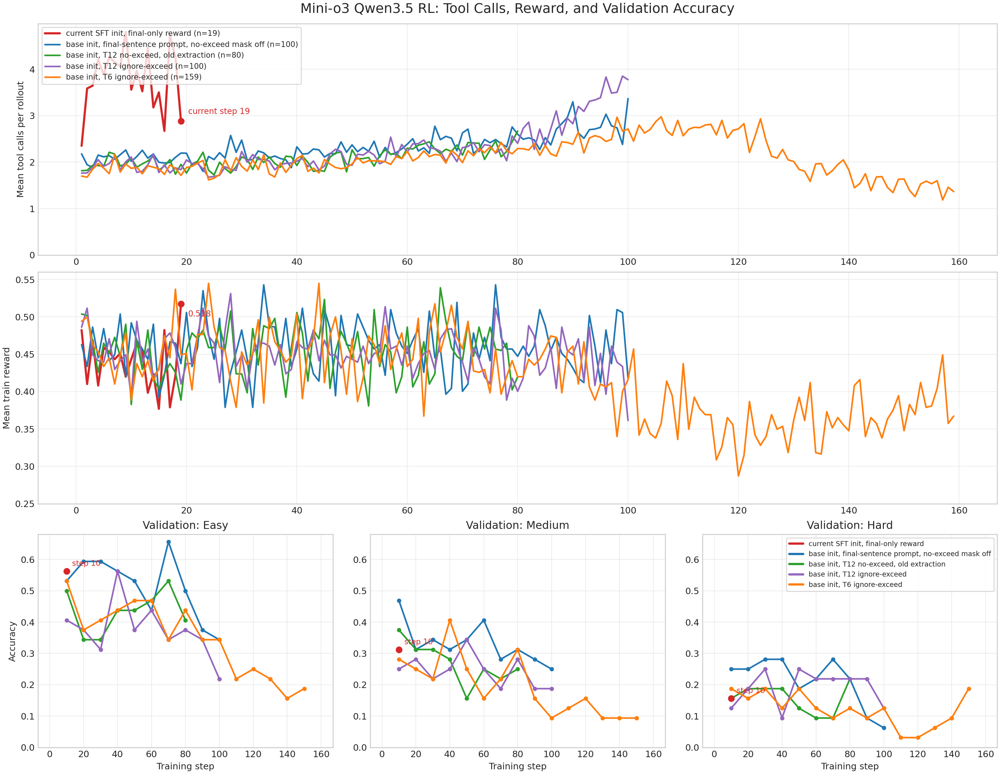
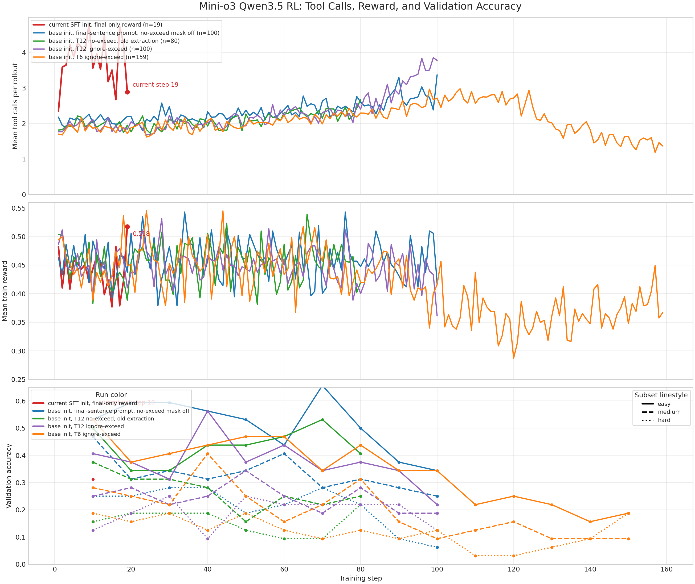

# Reward And Tool-Call Observations

Snapshot date: 2026-05-31.

This note records the current comparison between Mini-o3 Qwen3.5 RL runs, with
train tool-call behavior, train reward, and VisualProbe validation accuracy on
easy / medium / hard subsets.

## Plots

Readable split view:



Earlier combined validation view:



Raw plotted data:

- `artifacts/reward_toolcall_20260531/tool_call_reward_by_step.csv`
- `artifacts/reward_toolcall_20260531/validation_accuracy_by_step.csv`

## Metric Definitions

`tool_call_count` and `num_turns/mean` are related but not identical.

In the agent loop, `num_turns` is recorded as:

```text
user_turns + assistant_turns + 1
```

For a normal trajectory with `k` tool calls and one final assistant answer:

```text
assistant turns = k tool-call turns + 1 final-answer turn
tool/user-observation turns = k
num_turns = 2k + 2
```

So `num_turns/mean` is a chat-turn count, while `tool_call_count` is the direct
zoom/tool-use count. For monitoring whether the model is learning to keep
clicking tools, `tool_call_count` and `exceed_sample_ratio` are the clearer
signals.

## Included Runs

| Run | Train steps in plot | Latest tool calls | Latest train reward | Latest validation |
| --- | ---: | ---: | ---: | --- |
| current SFT init, final-only reward | 1-19 | 2.885 | 0.5176 | step 10: easy 0.5625, medium 0.3125, hard 0.1562 |
| base init, final-sentence prompt, no-exceed mask off | 1-100 | 3.369 | 0.4180 | step 100: easy 0.3438, medium 0.2500, hard 0.0625 |
| base init, T12 no-exceed, old extraction | 1-80 | 2.670 | 0.4199 | step 80: easy 0.4062, medium 0.2500, hard 0.2188 |
| base init, T12 ignore-exceed | 1-100 | 3.775 | 0.3613 | step 100: easy 0.2188, medium 0.1875, hard 0.1250 |
| base init, T6 ignore-exceed | 1-159 | 1.365 | 0.3672 | step 150: easy 0.1875, medium 0.0938, hard 0.1875 |

## Observations

The current SFT-initialized run starts with much higher tool-use density than
the earlier base-initialized runs. Its first 10 steps averaged about 3.85 tool
calls per rollout, while the previous base-initialized T12 runs started near
2.0 tool calls.

By step 19, the current run's latest tool-call mean dropped to 2.885 and train
reward spiked to 0.5176. This is a single-step high point, not yet a trend.
The latest available validation for the current run is only step 10, so it is
too early to conclude that the reward spike transferred to validation.

The older T12 ignore-exceed run shows the clearest bad pattern: tool calls rose
late to 3.775 by step 100, train reward fell to 0.3613, and validation also
degraded. This supports using tool-call growth as an early warning signal.

The older T6 run's late tool-call decline is not a healthy signal by itself. It
happened after many turn-limit/exceed failures and reward degradation, so low
tool-call count must be interpreted together with reward, exceed ratio, and
validation.

Train reward alone is insufficient for deciding whether a run is improving.
For this family of runs, monitor at least:

```text
tool_call_count_mean
batch/exceed_sample_ratio
critic/rewards/mean
validation easy / medium / hard accuracy
```
